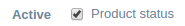

form-field-checkbox
===================

Render a checkbox.

Binding reference
-----------------

- ``field-id``: A unique HTML id to associate label and input (string)
- ``field-label``: The label text (string)
- ``field-placeholder``: The input placeholder, default empty (string)
- ``field-width``: The width of the field in bootstrap columns (1-12), default 6 (integer)
- ``field-label-width``: The width of the label in bootstrap columns (1-12), default 3 (integer)
- ``field-value``: A controller variable to return the ``ng-model`` input value (variable)
- ``on-change``: A callback function to call if value changes (function)

Transclude
----------

The component allows transclude to provide additional markup.

Code sample
-----------

::

        <form-field-checkbox field-id="product-status"
                             field-label="Active"
                             field-placeholder="Product status"
                             field-value="$ctrl.product.status"></form-field-checkbox>

`Reference`_

.. _Reference: https://github.com/Wtower/phoebe4/blob/34d39c43867c231936a1ea155dae7f51e05c792a/angular/product-detail/product-detail.template.html#L64
