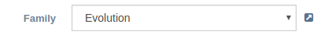

form-field-select
=================

Render a gentelella form select box. Depending on the options provided this can be extended to multiple selection.

Binding reference
-----------------

- ``field-id``: A unique HTML id to associate label and input (string)
- ``field-label``: The label text (string)
- ``field-placeholder``: The input placeholder, default empty (string)
- ``field-width``: The width of the field in bootstrap columns (1-12), default 6 (integer)
- ``field-label-width``: The width of the label in bootstrap columns (1-12), default 3 (integer)
- ``field-required``: Whether the field is required, default false (boolean)
- ``field-multiple``: Allow multiple selection, default false (boolean)
- ``field-link``: Provide a URL to present a link next to the combo box, default empty (string)
- ``field-link-text``: A description of the above link to present on hover (string)
- ``field-value``: A controller variable to return the ``ng-model`` input value (variable)
- ``on-change``: A callback function to call if value changes (function)

Controller
----------

The controller initializes the gentelella select2 script (currently disabled due to `issue #11`_.

.. _issue #11: https://github.com/Wtower/ng-gentelella/issues/11

Code sample
-----------

::

        <form-field-select field-id="product-family"
                           field-label="Family"
                           field-placeholder="Product Family"
                           field-link="#!/product-families"
                           field-link-text="Open family"
                           field-value="$ctrl.product.family">
          <option></option>
          <option ng-repeat="item in $ctrl.productFamilies | orderBy:''"
                  value="{{ item._id }}">{{ item.name }}</option>
        </form-field-select>

`Reference`_

.. _Reference: https://github.com/Wtower/phoebe4/blob/34d39c43867c231936a1ea155dae7f51e05c792a/angular/product-detail/product-detail.template.html#L39
