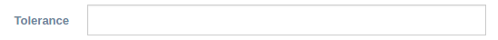

form-field-text
===============

Render a standard gentelella form textbox.

Binding reference
-----------------

- ``field-id``: A unique HTML id to associate label and input (string)
- ``field-type``: The `HTML input type`_, default ``text`` (string)
- ``field-label``: The label text (string)
- ``field-placeholder``: The input placeholder, default empty (string)
- ``field-width``: The width of the field in bootstrap columns (1-12), default 6 (integer)
- ``field-label-width``: The width of the label in bootstrap columns (1-12), default 3 (integer)
- ``field-required``: Whether the field is required, default false (boolean)
- ``field-form``: The controller form variable to update if validation is required (variable)
- ``field-name``: The field's name in the `Angular form`_. Requires ``field-form`` (string)
- ``field-pattern``: A regular expression **without surrounding slashes** to test the input validity against.
  Combine with ``field-form`` and ``field-name`` to allow Angular to validate (string)
- ``field-alert``: The text to display if the field is invalid. Requires ``field-form`` and ``field-name`` (string)
- ``field-model-options``: Additional `ng-model-options`_ to pass to the field (object)
- ``field-value``: A controller variable to return the ``ng-model`` input value (variable)
- ``on-change``: A callback function to call if value changes (function)

.. _HTML input type: https://developer.mozilla.org/en-US/docs/Web/HTML/Element/input
.. _Angular form: https://docs.angularjs.org/guide/forms
.. _ng-model-options: https://docs.angularjs.org/api/ng/directive/ngModelOptions

Controller
----------

The controller initializes the default values and regex pattern.

Code sample
-----------

::

        <form-field-text field-id="product-name"
                         field-label="Name"
                         field-placeholder="Product full name"
                         field-required="true"
                         field-value="$ctrl.product.name"></form-field-text>

        <form-field-text field-id="product-alias"
                         field-label="Alias"
                         field-placeholder="Unique machine name"
                         field-required="true"
                         field-width="5"
                         field-name="productAlias"
                         field-form="$ctrl.productEdit"
                         field-pattern="^[a-z0-9-]+$"
                         field-alert="Example: 'my-product'"
                         field-value="$ctrl.product.alias"></form-field-text>

`Reference`_

.. _Reference: https://github.com/Wtower/phoebe4/blob/34d39c43867c231936a1ea155dae7f51e05c792a/angular/product-detail/product-detail.template.html
