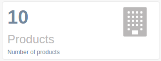

ga-dashboard-counter
====================

Provide a large counter panel for dashboard as in `Gentelella index2`_.

.. _Gentelella index2: https://colorlib.com/polygon/gentelella/index2.html

Binding reference
-----------------

- ``counter-icon``: A `font awesome`_ icon name, eg ``building`` (string)
- ``counter-var``: The number to present (integer)
- ``counter-title``: The title to present (string)

.. _font awesome: https://colorlib.com/polygon/gentelella/icons.html

Transclude
----------

The component allows transclude to present additional text.

Code sample
-----------

::

  <ga-dashboard-counter counter-icon="users"
                        counter-var="$ctrl.dashboard.users"
                        counter-title="Users">
    Number of total users
  </ga-dashboard-counter>

`Reference`_

.. _Reference: https://github.com/Wtower/generator-makrina/blob/master/generators/angular-app/templates/dashboard/dashboard.template.html
