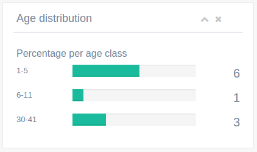

ga-dashboard-graph-bars
=======================

Render a bars graph in panel as in `Gentelella index`_. The graph consists of :doc:`ga-progress` bars.

.. _Gentelella index: https://colorlib.com/polygon/gentelella/index.html

Binding reference
-----------------

- ``graph-title``: The graph panel title (string)
- ``graph-sub-title``: The subtitle presented next to title in smaller font size (string)
- ``graph-heading``: The heading in the content (string)
- ``graph-data``: The main graph data (array)

The graph data should follow the format:

::

  [{lower: 1, upper: 5, percentage: 15, count: 6}, ...]

Transclude
----------

The component allows the transclude of further content below.

Code sample
-----------

::

    <ga-dashboard-graph-bars graph-title="Age distribution"
                             graph-heading="Percentage per age class"
                             graph-data="$ctrl.dashboard.ages"></ga-dashboard-graph-bars>

