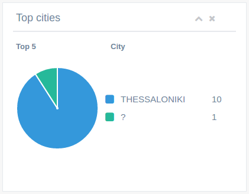

ga-dashboard-graph-chart
========================

Render a `chart.js`_ graph in panel as in `Gentelella index`_.

.. _chart.js: http://www.chartjs.org/docs/
.. _Gentelella index: https://colorlib.com/polygon/gentelella/index.html

Binding reference
-----------------

- ``graph-title``: The graph panel title (string)
- ``graph-sub-title``: The subtitle presented next to title in smaller font size (string)
- ``graph-heading``: The heading or name of the series (string)
- ``graph-id``: A unique HTML id for jquery reference, default ``main-graph`` (string)
- ``graph-type``: The Chart.js type: line, bar, radar, pie, doughnut, bubble (string)
- ``graph-max-values``: If the values provided are more than this number, the remaining will be added to the last.
  For example, if the chart shows top 5 cities, and 6 are provided, the 6th value will be added to the 5th.
  Default 5 (integer)
- ``graph-max-ellipsis``: If the above parameter is used, the text to replace the last label with.
  Default 'All others' (string)
- ``graph-colours``: An array of strings with colours for the series, defaults to gentelella colours (array)
- ``graph-data``: The main graph data (array)

The graph data should follow the format:

::

  [{label: '', value: 0}, ...]

Transclude
----------

The component allows the transclude of further content below.

Controller
----------

The controller:

- Groups the data to the specified maximum (if any).
- Transforms the data from the above more common JSON format to Chart.js format.
- Initializes the Chart.js graph appropriately.

Code sample
-----------

::

    <ga-dashboard-graph-chart graph-title="Top cities"
                              graph-heading="City"
                              graph-id="canvas2"
                              graph-type="pie"
                              graph-data="$ctrl.dashboard.cities"></ga-dashboard-graph-chart>

