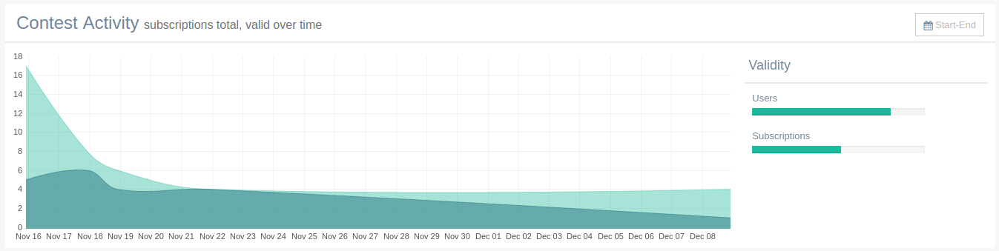

ga-dashboard-graph-flot
=======================

Render a line graph in panel as in `Gentelella index`_.

.. _Gentelella index: https://colorlib.com/polygon/gentelella/index.html

Binding reference
-----------------

- ``graph-title``: The graph panel title (string)
- ``graph-sub-title``: The subtitle presented next to title in smaller font size (string)
- ``graph-range``: The date range to present (string)
- ``graph-id``: A unique HTML id for jquery reference, default ``main-graph`` (string)
- ``graph-legend-title``: The title of the legent column (string)
- ``graph-colours``: An array of strings with colours for the series, defaults to gentelella colours (array)
- ``graph-data``: The main graph data (array)

Regarding the graph data. Gentelella uses the `Flot`_ graph library that requires that data is sorted by date.
Otherwise the data looks bizarre. The graph data should follow the format:

.. _Flot: http://www.flotcharts.org/

::

  [
    {
      _id: {year: 2016, month: 12, day: 19},
      count: 10
    },
    ...
  ]

Transclude
----------

The component allows the transclude of markup for the legend column body.

Controller
----------

The controller:

- Transforms the data from the above more common JSON format to Flot format.
- Initializes the Flot graph appropriately.

Code sample
-----------

::

    <ga-dashboard-graph-flot graph-title="Contest Activity"
                             graph-sub-title="subscriptions total, valid over time"
                             graph-legend-title="Validity"
                             graph-range="Start-End"
                             graph-data="$ctrl.dashboard.data">
      

        
Users

        <ga-progress progress-value="$ctrl.userValidity"></ga-progress>
      

      

        
Subscriptions

        <ga-progress progress-value="$ctrl.subscriptionValidity"></ga-progress>
      

    </ga-dashboard-graph-flot>

