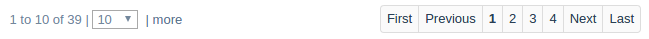

ga-paginate
===========

Provide a list paginator.

Binding reference
-----------------

- ``paginate-id``: A unique HTML id for the page size combo box (string)
- ``paginate-page``: A controller variable in which the current page number will be returned (variable)
- ``paginate-size``: A controller variable in which the current page size will be returned (variable)
- ``paginate-initial-size``: The initial page size (integer)
- ``paginate-sizes``: An array of page sizes, default ``[10, 25, 50, 100]`` (array)
- ``paginate-count``: The total number of records (integer)
- ``paginate-ellipsis``: The maximum number of page numbers to show if too many, default 5. For more than that,
  ellipsis ``...`` are presented (integer)
- ``on-paginate``: A callback function to call when a new page is selected. Used to fetch new data (function)

Transclude
----------

The controller presents additional test right of the page size combo box such as a link.

Controller
----------

The controller handles the operation of the paginator.

Code sample
-----------

::

  <ga-paginate paginate-id="paginate-subscriptions"
               paginate-page="$ctrl.page"
               paginate-size="$ctrl.pageSize"
               paginate-initial-size="$ctrl.viewLimit"
               paginate-count="$ctrl.count"
               on-paginate="$ctrl.getList(paginator)">
    <a href="#!{{ $ctrl.viewLink }}">| more</a>
  </ga-paginate>

