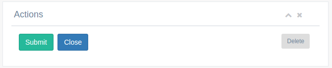

ga-panel-actions
================

This offers a small panel with basic form buttons: Save, Close/cancel, delete.

Binding reference
-----------------

- ``action-form``: The parent form controller variable to use in order to check if form is clean (variable)
- ``action-close-url``: A url to redirect to if user hits close (string)
- ``action-allow-delete``: True to allow delete (boolean)
- ``on-delete``: A callback function to call if user hits delete (function)

Requires
--------

Requires a parent :doc:`ga-panel`.

Transclude
----------

The controller allows transclude in order to present additional markup such as more buttons next to Delete.

Code sample
-----------

::

      <ga-panel panel-title="Actions">
        <ga-panel-actions action-form="$ctrl.<%= objectName %>Edit"
                          action-close-url="#!/<%= objectUrl %>s"
                          action-allow-delete="$ctrl.<%= objectName %>Id"
                          on-delete="$ctrl.delete<%= objectTitle %>()"></ga-panel-actions>
      </ga-panel>

`Reference`_

.. _Reference: https://github.com/Wtower/generator-makrina/blob/master/generators/angular-component-detail/templates/_object-name_-detail.template.html#L19
