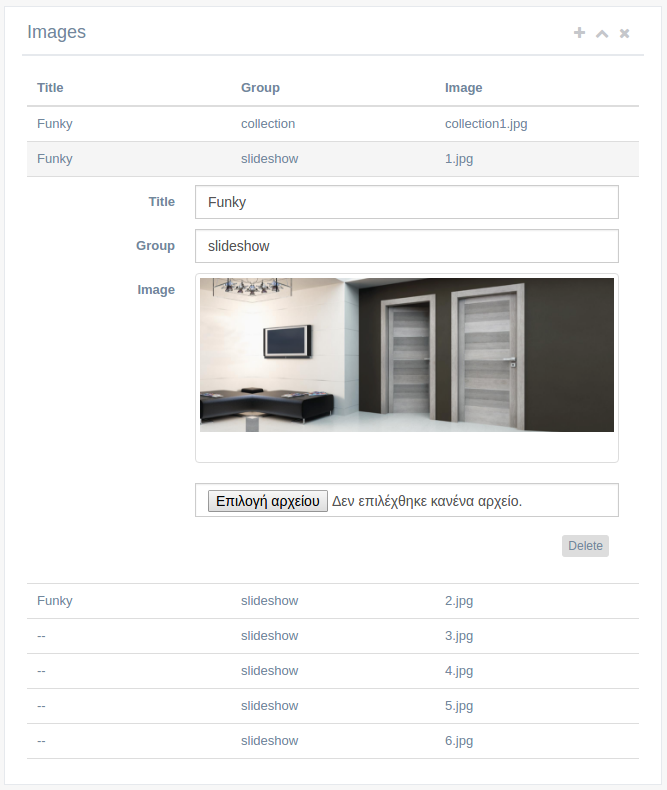

ga-panel-table-form
===================

``ga-panel-table-form`` together with ``ga-panel-table-form-body`` offer a more advanced :doc:`ga-panel`
that can be used to display a table of records. Upon clicking on a record, an accordion with
a form for that record opens.

Binding reference
-----------------

ga-panel-table-form bindings
^^^^^^^^^^^^^^^^^^^^^^^^^^^^

- ``panel-title``: The panel title (string)
- ``panel-subtitle``: The panel subtitle displayed in smaller font next to the title (string)
- ``panel-add-record``: Whether to allow add record. Usually evaluated by an expression, eg. new vs edit op (boolean)
- ``panel-values``: A controller variable honding an array of the records (variable)

ga-panel-table-form-body bindings
^^^^^^^^^^^^^^^^^^^^^^^^^^^^^^^^^

- ``body-id``: A unique id for each table row that will be used by bootstrap accordion (string)
- ``body-value``: The variable from the ``ng-repeat`` that will be used to render the table (variable)

Transclude
----------

ga-panel-table-form transclude
^^^^^^^^^^^^^^^^^^^^^^^^^^^^^^

The component allows for two elements for transclude:

- ``<panel-table-form-head>``: Used to display the table headers. Refrain from using ``<table>`` elements or CSS styles,
  and use the bootstrap grid instead because the table rendering might break in some browsers.
- ``<panel-table-form-body>``: This is where the ``ga-panel-table-form-body`` component will be used with ``ng-repeat``
  to present a table row with data and a form row with data detail.

ga-panel-table-form-body transclude
^^^^^^^^^^^^^^^^^^^^^^^^^^^^^^^^^^^

The component allows to transclude. Add in here the table row and the form row.

Controller
----------

The ``ga-panel-table-form`` controller handles the add/delete operations of the table.

Code sample
-----------

Template:

::

      <ga-panel-table-form panel-title="Specifications"
                           panel-add-record="$ctrl.skuId"
                           panel-values="$ctrl.sku.specs">
        <panel-table-form-head>
          
Spec

          
Value

        </panel-table-form-head>

        <panel-table-form-body>
          <ga-panel-table-form-body ng-repeat="spec in $ctrl.sku.specs"
                                    body-id="spec-{{ $index }}"
                                    body-value="spec">
            <body-row>
              
{{ (spec.spec || '--' }}

              
{{ ((spec.value || '--' }}

            </body-row>

            <body-form>
              <form-field-text>...</form-field-text>
              ...
            </body-form>
          </ga-panel-table-form-body>
        </panel-table-form-body>
      </ga-panel-table-form>

`Reference`_

.. _Reference: https://github.com/Wtower/phoebe4/blob/34d39c43867c231936a1ea155dae7f51e05c792a/angular/sku-detail/sku-detail.template.html#L58
