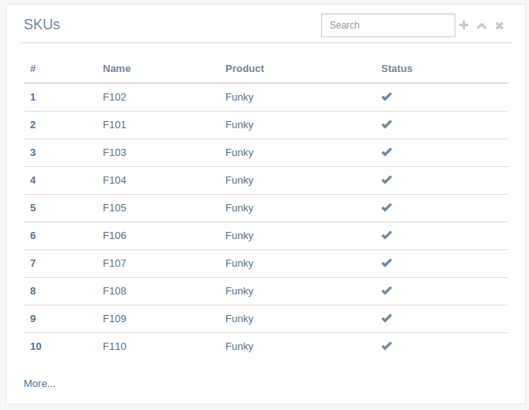

ga-panel
========

This is a main component that generates a simple gentelella panel.

Binding reference
-----------------

- ``panel-title``: The panel title (string)
- ``panel-subtitle``: The panel subtitle displayed in smaller font next to the title (string)
- ``panel-query``: Whether to show a small input text box usually for filtering (boolean)
- ``panel-query-string``: A controller variable to hold the ``panel-query`` input (variable)
- ``panel-add-record-url``: A url to direct for adding a record. If provided a + icon will be available (string)
- ``panel-query-model-options``: Additional `ng-model-options`_ to pass to the query field (object)
- ``on-query-change``: A callback function to call if query value changes (function)

.. _ng-model-options: https://docs.angularjs.org/api/ng/directive/ngModelOptions

Transclude
----------

The component will present any content transcluded.

It also allows the optional transclude element ``panel-toolbar`` for presenting additional buttons
(v0.2.5, see examples below).

Controller
----------

The component will initiate the necessary jquery required by gentelella as well.

Code sample
-----------

Using simple filter
^^^^^^^^^^^^^^^^^^^

Template:

::

  <ga-panel panel-title="Products"
            panel-query="true"
            panel-query-string="$ctrl.queryValue"
            panel-add-record-url="#!/products/add">
    <panel-toolbar>
      <a href="" title="Some button"><i class="fa fa-modx"></i></a>
      <a href="" title="And another"><i class="fa fa-random"></i></a>
    </panel-toolbar>
    <table class="table table-hover dataTable">
      <thead>
      <tr>
        <th>#</th>
        <th>Name</th>
      </tr>
      </thead>
      <tbody>
      <tr ng-repeat="product in $ctrl.products | filter:$ctrl.queryValue">
        <th scope="row"><a href="#!/products/{{ product._id }}">{{ $index + 1 }}</a></th>
        <td><a href="#!/products/{{ product._id }}">{{ product.name }}</a></td>
      </tr>
      </tbody>
    </table>
  </ga-panel>

Reference_

.. _Reference: https://github.com/Wtower/generator-makrina/blob/master/generators/angular-component-list/templates/_object-name_-list.template.html

Using callback function
^^^^^^^^^^^^^^^^^^^^^^^

Template:

::

  <ga-panel panel-title="Products"
            panel-query="true"
            panel-query-string="$ctrl.queryValue"
            panel-query-model-options="{debounce: 1000}"
            on-query-change="$ctrl.filter(queryValue)"
            panel-add-record-url="#!/products/add">
    <table class="table table-hover dataTable">
      <thead>
      <tr>
        <th>#</th>
        <th>Name</th>
      </tr>
      </thead>
      <tbody>
      <tr ng-repeat="product in $ctrl.products">
        <th scope="row"><a href="#!/products/{{ product._id }}">{{ $index + 1 }}</a></th>
        <td><a href="#!/products/{{ product._id }}">{{ product.name }}</a></td>
      </tr>
      </tbody>
    </table>
  </ga-panel>

