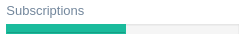

ga-progress
===========

Render a progress bar.

Binding reference
-----------------

- ``progress-size``: The progress bar size ``sm`` or ``md``, default ``sm`` (string)
- ``progress-value``: The progress bar percent value (number)

Notice: ``progress-value`` binding since v0.2.4 has changed to ``@`` requiring to be passed with ``{{ }}``.
This allows calculations in template.

Code sample
-----------

::

        <ga-progress progress-value="{{ $ctrl.progress }}"></ga-progress>
        <ga-progress progress-value="{{ (item.count / $ctrl.total * 100) | number: 0 }}"></ga-progress>

